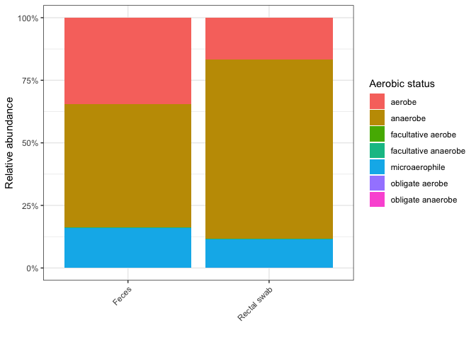
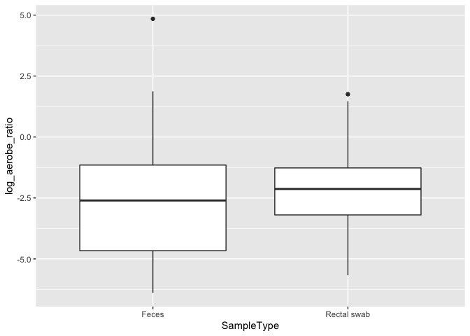
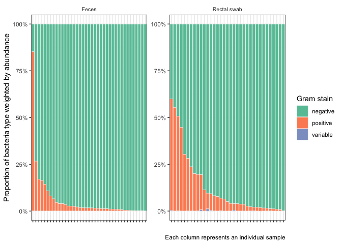

<!-- README.md is generated from README.Rmd. Please edit that file -->

# bacphene

<!-- badges: start -->
<!-- badges: end -->

The goal of bacphene is to generate a table of phenotype characteristics
about your samples. Input is a table of Samples with counts per taxa.

The package utilizes the official [BacDive R
package](https://r-forge.r-project.org/R/?group_id=1573) that accesses
bacterial phenotype data from [bacdive.org](https://bacdive.dsmz.de).

## Installation

You can install bacphene from the [github
repo](https://github.com/scottdaniel/bacphene). You also need to install
the BacDive R package (if you want the full data - see below).

``` r
library(devtools)
install_github(repo = "scottdaniel/bacphene")
install.packages("BacDive", repos="http://R-Forge.R-project.org")
```

After this, you may register at bacdive.org
[here](https://api.bacdive.dsmz.de/login).

### Recommended

Edit your $HOME/.Renviron file (you can open in R with
`usethis::edit_r_environ()`) and add your bacdive credentials like so:

    DSMZ_API_USER=your_email@something.com
    DSMZ_API_PASSWORD=your_password

If you do not register, you will not be able to download the full
information on strains in BacDive. Instead, what you will get is access
to three data-frames: `bacdive_phenotypes`, `bacdive_susceptibility`,
and `bacdive_enzymes`. Which look like this:

``` r
library(bacphene)
head(bacdive_phenotypes)
#> # A tibble: 6 × 4
#>   taxon                         rank    gram_stain aerobic_status   
#>   <chr>                         <chr>   <chr>      <chr>            
#> 1 Abiotrophia defectiva         Species <NA>       microaerophile   
#> 2 Abyssibacter profundi         Species negative   aerobe           
#> 3 Abyssivirga alkaniphila       Species positive   obligate anaerobe
#> 4 Acanthopleuribacter pedis     Species negative   aerobe           
#> 5 Acaricomes phytoseiuli        Species positive   aerobe           
#> 6 Acetanaerobacterium elongatum Species positive   anaerobe
```

``` r
head(bacdive_susceptibility)
#> # A tibble: 6 × 4
#>   taxon                      rank    antibiotic      value    
#>   <chr>                      <chr>   <chr>           <chr>    
#> 1 Achromobacter marplatensis Species d-serine        resistant
#> 2 Achromobacter marplatensis Species fusidate        resistant
#> 3 Achromobacter marplatensis Species nalidixic acid  resistant
#> 4 Achromobacter marplatensis Species niaproof        resistant
#> 5 Achromobacter marplatensis Species sodium bromate  sensitive
#> 6 Achromobacter marplatensis Species sodium butyrate resistant
```

``` r
head(bacdive_enzymes)
#> # A tibble: 6 × 7
#>       ID taxon                 rank    activity value               ec     doi  
#>    <int> <chr>                 <chr>   <chr>    <chr>               <chr>  <chr>
#> 1 159837 Abyssibacter profundi Species -        acid phosphatase    3.1.3… 10.1…
#> 2 159837 Abyssibacter profundi Species -        alpha-galactosidase 3.2.1… 10.1…
#> 3 159837 Abyssibacter profundi Species -        alpha-glucosidase   3.2.1… 10.1…
#> 4 159837 Abyssibacter profundi Species -        alpha-mannosidase   3.2.1… 10.1…
#> 5 159837 Abyssibacter profundi Species -        beta-glucosidase    3.2.1… 10.1…
#> 6 159837 Abyssibacter profundi Species -        beta-glucuronidase  3.2.1… 10.1…
```

## Demo

Our test data-set is from Shen et al. 2021 and contains taxonomic counts
from metagenomic shotgun alignments. See `?Shen2021` for a full
description of the columns. With our test data and bacdive we can ask a
few questions:

### Do the rectal swabs contain more oxygen tolerant organisms?

``` r
library(tidyverse)
#> ── Attaching packages ─────────────────────────────────────── tidyverse 1.3.1 ──
#> ✓ ggplot2 3.3.5     ✓ purrr   0.3.4
#> ✓ tibble  3.1.3     ✓ dplyr   1.0.7
#> ✓ tidyr   1.1.3     ✓ stringr 1.4.0
#> ✓ readr   2.0.0     ✓ forcats 0.5.1
#> ── Conflicts ────────────────────────────────────────── tidyverse_conflicts() ──
#> x dplyr::filter() masks stats::filter()
#> x dplyr::lag()    masks stats::lag()

my_df <- Shen2021 %>%
  left_join(bacdive_phenotypes, by = "taxon") %>%
  mutate(prop = count / read_counts) %>%
  group_by(SampleID, aerobic_status) %>%
  filter(count > 0, !is.na(aerobic_status)) %>%
  summarise(n = n(), weighted_n = sum(prop) * n(), .groups = "drop") %>%
  ungroup()

sort_order <- my_df %>%
  group_by(SampleID) %>%
  mutate(prop = weighted_n / sum(weighted_n)) %>%
  filter(aerobic_status %in% "anaerobe") %>%
  arrange(prop) %>%
  pull(SampleID)

my_df %>%
  left_join(Shen2021 %>% select(SampleID, SampleType) %>% unique(), by = "SampleID") %>%
  mutate(SampleID = fct_relevel(SampleID, sort_order)) %>%
  mutate(aerobic_status = fct_relevel(aerobic_status, "anaerobe", "aerobe")) %>%
  
  ggplot(aes(x = SampleID, y = weighted_n, fill = aerobic_status)) +
  geom_bar(stat = "identity", position = "fill") +
  theme_bw() +
  theme(strip.text.x = element_text(size = 8),
        strip.background = element_blank(),
        axis.text.x = element_blank()) +
  facet_wrap(~SampleType, scales = "free") +
  scale_y_continuous(labels = scales::percent) +
  scale_fill_brewer(palette = "Set1") +
  labs(y = "Proportion of bacteria type weighted by abundance", x = "", fill = "Aerobic status", caption = "Each column represents an individual sample")
```



What are contributing most to these counts?

#### Top taxa in feces

``` r
library(pander)

top_taxa_feces <- Shen2021 %>%
  left_join(bacdive_phenotypes, by = "taxon") %>%
  filter(SampleType %in% "Feces") %>%
  group_by(SampleType, aerobic_status, taxon) %>%
  summarise(total_count = sum(count), .groups = "drop") %>%
  mutate(percentage = paste(round((total_count / sum(total_count))*100), "%")) %>%
  slice_max(order_by = total_count, n = 10)

top_taxa_feces %>% pander(split.table = Inf, split.cells = 20, digits = 2)
```

| SampleType | aerobic\_status |            taxon             | total\_count | percentage |
|:----------:|:---------------:|:----------------------------:|:------------:|:----------:|
|   Feces    |    anaerobe     |     Bacteroides vulgatus     |    2e+07     |    18 %    |
|   Feces    |    anaerobe     |      Bacteroides ovatus      |   1.2e+07    |    11 %    |
|   Feces    |    anaerobe     |      Bacteroides dorei       |   1.2e+07    |    11 %    |
|   Feces    |     aerobe      |       Escherichia coli       |   9936438    |    9 %     |
|   Feces    |    anaerobe     |     Veillonella parvula      |   5770211    |    5 %     |
|   Feces    | microaerophile  |     Enterococcus faecium     |   4872165    |    4 %     |
|   Feces    |    anaerobe     | Bacteroides thetaiotaomicron |   3898980    |    3 %     |
|   Feces    |    anaerobe     |     Bacteroides fragilis     |   3777075    |    3 %     |
|   Feces    |     aerobe      |    Klebsiella pneumoniae     |   2474785    |    2 %     |
|   Feces    |    anaerobe     |    Bacteroides caecimuris    |   2260004    |    2 %     |

#### Top taxa in rectal swab

``` r
top_taxa_rectal <- Shen2021 %>%
  left_join(bacdive_phenotypes, by = "taxon") %>%
  filter(SampleType %in% "Rectal swab") %>%
  group_by(SampleType, aerobic_status, taxon) %>%
  summarise(total_count = sum(count), .groups = "drop") %>%
  mutate(percentage = paste(round((total_count / sum(total_count))*100), "%")) %>%
  slice_max(order_by = total_count, n = 10)

top_taxa_rectal %>% pander(split.table = Inf, split.cells = 20, digits = 2)
```

| SampleType  | aerobic\_status |             taxon             | total\_count | percentage |
|:-----------:|:---------------:|:-----------------------------:|:------------:|:----------:|
| Rectal swab |    anaerobe     |     Bacteroides vulgatus      |   6640257    |    16 %    |
| Rectal swab |    anaerobe     |       Bacteroides dorei       |   5455534    |    13 %    |
| Rectal swab |     aerobe      |       Escherichia coli        |   2431818    |    6 %     |
| Rectal swab |    anaerobe     |      Bacteroides ovatus       |   2156264    |    5 %     |
| Rectal swab |    anaerobe     |     Bacteroides fragilis      |    2e+06     |    5 %     |
| Rectal swab |    anaerobe     |       Finegoldia magna        |   1880837    |    5 %     |
| Rectal swab |    anaerobe     |      Veillonella parvula      |   1783028    |    4 %     |
| Rectal swab |    anaerobe     | Bacteroides thetaiotaomicron  |   1693954    |    4 %     |
| Rectal swab |    anaerobe     | Faecalibacterium prausnitzii  |   1591240    |    4 %     |
| Rectal swab |    anaerobe     | Porphyromonas asaccharolytica |   1223907    |    3 %     |

#### Is the aerobe / anaerobe ratio significantly different?

``` r
totals_df <- my_df %>%
  pivot_wider(-n, names_from = "aerobic_status", values_from = "weighted_n") %>%
  mutate(log_aerobe_ratio = log(aerobe / anaerobe)) %>%
  left_join(Shen2021 %>% select(SampleID, SampleType) %>% unique(), by = "SampleID")

my_lm <- lm(log_aerobe_ratio ~ SampleType, data = totals_df)

summary(my_lm)
#> 
#> Call:
#> lm(formula = log_aerobe_ratio ~ SampleType, data = totals_df)
#> 
#> Residuals:
#>     Min      1Q  Median      3Q     Max 
#> -3.8089 -1.7570  0.1451  1.3841  7.4353 
#> 
#> Coefficients:
#>                       Estimate Std. Error t value Pr(>|t|)    
#> (Intercept)            -2.5868     0.3634  -7.119 6.67e-10 ***
#> SampleTypeRectal swab   0.2112     0.5284   0.400     0.69    
#> ---
#> Signif. codes:  0 '***' 0.001 '**' 0.01 '*' 0.05 '.' 0.1 ' ' 1
#> 
#> Residual standard error: 2.269 on 72 degrees of freedom
#> Multiple R-squared:  0.002215,   Adjusted R-squared:  -0.01164 
#> F-statistic: 0.1598 on 1 and 72 DF,  p-value: 0.6905
```

##### Graph

``` r
totals_df %>%
  ggplot(aes(x = SampleType, y = log_aerobe_ratio)) +
  geom_boxplot()
```



Looks like there are slightly more aerobes compared to anaerobes in the
rectal swabs but not enough to be statistically significant.

### Differences in gram-staining

``` r
my_df <- Shen2021 %>%
  left_join(bacdive_phenotypes, by = "taxon") %>%
  mutate(prop = count / read_counts) %>%
  group_by(SampleID, gram_stain) %>%
  filter(count > 0, !is.na(gram_stain)) %>%
  summarise(n = n(), weighted_n = sum(prop) * n(), .groups = "drop") %>%
  ungroup()

sort_order <- my_df %>%
  group_by(SampleID) %>%
  mutate(prop = weighted_n / sum(weighted_n)) %>%
  filter(gram_stain %in% "negative") %>%
  arrange(prop) %>%
  pull(SampleID)

my_df %>%
  left_join(Shen2021 %>% select(SampleID, SampleType) %>% unique(), by = "SampleID") %>%
  mutate(SampleID = fct_relevel(SampleID, sort_order)) %>%
  mutate(gram_stain = fct_relevel(gram_stain, "negative", "positive")) %>%
  
  ggplot(aes(x = SampleID, y = weighted_n, fill = gram_stain)) +
  geom_bar(stat = "identity", position = "fill") +
  theme_bw() +
  theme(strip.text.x = element_text(size = 8),
        strip.background = element_blank(),
        axis.text.x = element_blank()) +
  facet_wrap(~SampleType, scales = "free") +
  scale_y_continuous(labels = scales::percent) +
  scale_fill_brewer(palette = "Set2") +
  labs(y = "Proportion of bacteria type weighted by abundance", x = "", fill = "Gram stain", caption = "Each column represents an individual sample")
```



## References

When using BacDive for research please consider citing the following
paper:

BacDive in 2019: bacterial phenotypic data for High-throughput
biodiversity analysis. Reimer, L. C., Vetcininova, A., Sardà Carbasse,
J., Söhngen, C., Gleim, D., Ebeling, C., Overmann, J. [Nucleic Acids
Research; database issue
2019](https://academic.oup.com/nar/article/47/D1/D631/5106998).

Sample data set from: Shen, T.-C. D. et al. (2021) ‘The
Mucosally-Adherent Rectal Microbiota Contains Features Unique to
Alcohol-Related Cirrhosis’, [Gut microbes, 13(1),
p. 1987781.](https://www.ncbi.nlm.nih.gov/pubmed/34747331)

To cite this package enter `citation("bacphene")` in your R console.
