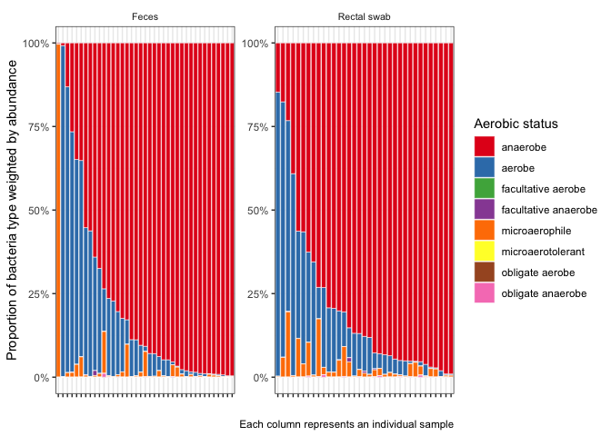

<!-- README.md is generated from README.Rmd. Please edit that file -->

# bacphene

<!-- badges: start -->
<!-- badges: end -->

The goal of bacphene is to generate a table of phenotype characteristics
about your samples. Input is a table of Samples with counts per taxa.

The package utilizes the official [BacDive R
package](https://r-forge.r-project.org/R/?group_id=1573) that accesses
bacterial phenotype data from [bacdive.org](https://bacdive.dsmz.de).

## Installation

You can install bacphene from the [github
repo](https://github.com/scottdaniel/bacphene). You also need to install
the BacDive R package (if you want the full data - see below).

``` r
library(devtools)
install_github(repo = "scottdaniel/bacphene")
install.packages("BacDive", repos="http://R-Forge.R-project.org")
```

After this, you may register at bacdive.org
[here](https://api.bacdive.dsmz.de/login).

### Recommended

Edit your $HOME/.Renviron file (you can open in R with
`usethis::edit_r_environ()`) and add your bacdive credentials like so:

    DSMZ_API_USER=your_email@something.com
    DSMZ_API_PASSWORD=your_password

If you do not register, you will not be able to download the full
information on strains in BacDive. Instead, what you will get is access
to three data-frames: `bacdive_phenotypes`, `bacdive_susceptibility`,
and `bacdive_enzymes`. Which look like this:

``` r
library(bacphene)
head(bacdive_phenotypes)
#> # A tibble: 6 × 5
#> # Groups:   taxon [6]
#>       ID taxon                         rank    gram_stain aerobic_status   
#>    <int> <chr>                         <chr>   <chr>      <chr>            
#> 1    219 Abiotrophia defectiva         Species <NA>       anaerobe         
#> 2 159837 Abyssibacter profundi         Species negative   aerobe           
#> 3 132478 Abyssivirga alkaniphila       Species positive   obligate anaerobe
#> 4  24718 Acanthopleuribacter pedis     Species negative   aerobe           
#> 5   7517 Acaricomes phytoseiuli        Species positive   <NA>             
#> 6 134101 Acetanaerobacterium elongatum Species positive   anaerobe
```

``` r
head(bacdive_susceptibility)
#> # A tibble: 6 × 5
#>       ID taxon                  rank    antibiotic      value      
#>    <int> <chr>                  <chr>   <chr>           <chr>      
#> 1 159709 Acidicapsa dinghuensis Species Amikacin        resistant  
#> 2 159709 Acidicapsa dinghuensis Species chloramphenicol susceptible
#> 3 159709 Acidicapsa dinghuensis Species ciprofloxacin   susceptible
#> 4 159709 Acidicapsa dinghuensis Species erythromycin    susceptible
#> 5 159709 Acidicapsa dinghuensis Species gentamicin      resistant  
#> 6 159709 Acidicapsa dinghuensis Species kanamycin       resistant
```

``` r
head(bacdive_enzymes)
#> # A tibble: 6 × 7
#>       ID taxon                 rank    activity value               ec     doi  
#>    <int> <chr>                 <chr>   <chr>    <chr>               <chr>  <chr>
#> 1 159837 Abyssibacter profundi Species -        acid phosphatase    3.1.3… 10.1…
#> 2 159837 Abyssibacter profundi Species -        alpha-galactosidase 3.2.1… 10.1…
#> 3 159837 Abyssibacter profundi Species -        alpha-glucosidase   3.2.1… 10.1…
#> 4 159837 Abyssibacter profundi Species -        alpha-mannosidase   3.2.1… 10.1…
#> 5 159837 Abyssibacter profundi Species -        beta-glucosidase    3.2.1… 10.1…
#> 6 159837 Abyssibacter profundi Species -        beta-glucuronidase  3.2.1… 10.1…
```

## Demo

Our test data-set is from Shen et al. 2021 and contains taxonomic counts
from metagenomic shotgun alignments. See `?Shen2021` for a full
description of the columns. With our test data and bacdive we can ask a
few questions:

### Do the rectal swabs contain more oxygen tolerant organisms?

While this may seem like an obvious “yes”, it still stands as a
proof-of-concept.

``` r
library(tidyverse)
#> ── Attaching packages ─────────────────────────────────────── tidyverse 1.3.1 ──
#> ✓ ggplot2 3.3.5     ✓ purrr   0.3.4
#> ✓ tibble  3.1.3     ✓ dplyr   1.0.7
#> ✓ tidyr   1.1.3     ✓ stringr 1.4.0
#> ✓ readr   2.0.0     ✓ forcats 0.5.1
#> ── Conflicts ────────────────────────────────────────── tidyverse_conflicts() ──
#> x dplyr::filter() masks stats::filter()
#> x dplyr::lag()    masks stats::lag()

my_df <- Shen2021 %>%
  left_join(bacdive_phenotypes, by = "taxon")

my_df %>%
  group_by(SampleType, aerobic_status) %>%
  filter(count > 0, !is.na(aerobic_status)) %>%
  summarise(n = n(), weighted_n = sum(count) * n(), .groups = "drop") %>%
  group_by(SampleType) %>%
  mutate(normalised_n = weighted_n / sum(weighted_n)) %>%
  ungroup() %>%
  ggplot(aes(x = SampleType, y = weighted_n, fill = aerobic_status)) +
    geom_bar(stat = "identity", position = "fill") +
  theme_bw() +
  theme(strip.text.x = element_text(size = 8),
        strip.background = element_blank(),
        axis.text.x = element_text(angle=45, hjust = 1)) +
  scale_y_continuous(labels = scales::percent) +
  labs(y = "Relative abundance", x = "", fill = "Aerobic status")
```



``` r
# Seems like there should still be more aerobic bacteria in the rectal swabs
```

``` r
top_taxa <- my_df %>%
  group_by(SampleType, aerobic_status, taxon) %>%
  summarise(total_count = sum(count), .groups = "drop") %>%
  slice_max(order_by = total_count, n = 5)
```

## References

When using BacDive for research please consider citing the following
paper:

BacDive in 2019: bacterial phenotypic data for High-throughput
biodiversity analysis. Reimer, L. C., Vetcininova, A., Sardà Carbasse,
J., Söhngen, C., Gleim, D., Ebeling, C., Overmann, J. [Nucleic Acids
Research; database issue
2019](https://academic.oup.com/nar/article/47/D1/D631/5106998).

To cite this package enter `citation("bacphene")` in your R console.
